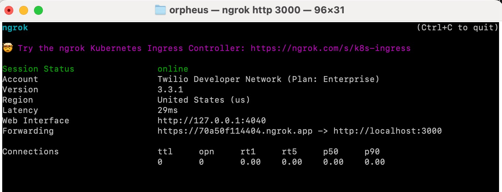

# The Twilio Programmable Voice Toolkit

The Twilio Programmable Voice (PV) Toolkit is intended to simplify the building of Twilio voice apps. It does so by hiding away the details of webhooks and status callbacks, allowing you to write your programs in a top-down, synchronous fashion.

The PV Toolkit was inspired by [Twilio Studio](https://www.twilio.com/docs/studio), which threads together building blocks ('Make call', 'Play or say message', 'Gather user input', and so on) in a way that is clear to understand, and hides away the details of the Twilio REST API and webhooks. Studio is great for quickly building applications, but it is not always appropriate for the more complex ones. Sometimes you just need the flexibility that a first-class programming language gives you.

The PV Toolkit makes use of the following:

- Node.js, running the Express web application framework.
- [Ngrok](https://ngrok.com/), for securely tunneling Twilio webhooks when running your apps behind a firewall. (Optional.)
- JavaScript [Promises](https://developer.mozilla.org/en-US/docs/Web/JavaScript/Reference/Global_Objects/Promise), the programming construct that allows you to perform an operation and wait for the result.

A post describing how to use the PV Toolkit, how it was built, and the use of Promises, can be found on the Twilio Blog (link TBP).

# Installation

As a prerequisite, you'll need to install [Node.js](https://nodejs.org/en/download) (version 18 or later). You may also want to use [Git](https://git-scm.com/) to download and update the PV Toolkit.

Once you've done that, download and install the PV Toolkit into your project folder as follows:

```sh
$ git clone https://github.com/RobWelbourn/TwilioPVToolkit.git
$ cd TwilioPVToolkit
$ npm install
```

If you prefer not to use Git, you can instead download the package as a zip file and then run `npm install` in the project folder.

Next, if you don't already have it, [install Ngrok](https://ngrok.com/download) and [sign up](https://dashboard.ngrok.com/signup) for a free account. Ngrok is a service which provides you with a public URL for an application that runs behind your firewall. The URL is connected to your application over a secure tunnel, which terminates at the Ngrok agent. The Ngrok agent is normally run as a stand-alone program, but there are also versions available as libraries that you can incorporate directly into your own application, for example, [this one](https://github.com/ngrok/ngrok-js) for Node.js.

> **Note**
> You don't need Ngrok to use the toolkit, but you will otherwise need to open up your firewall so that Twilio webhooks and status callbacks can reach your app.

Start the Ngrok agent on your local machine, using the command `ngrok http 3000`:



This creates a secure tunnel between a random and dynamically created public URL – in this case, https://70a50f114404.ngrok.app – and the Ngrok agent on your computer. This URL will change every time you restart the agent, but if you want a permanent URL for configuring your Twilio webhooks, you can get one through a paid Ngrok subscription.
The tunnel will take HTTPS traffic on port 443 and feed it to your local web server as unencrypted HTTP on port 3000. You may notice that there's a local web interface, and this allows us to interrogate the agent to determine the public URL and the local port the server is running on. We'll make use of this API when setting up the local web server.
